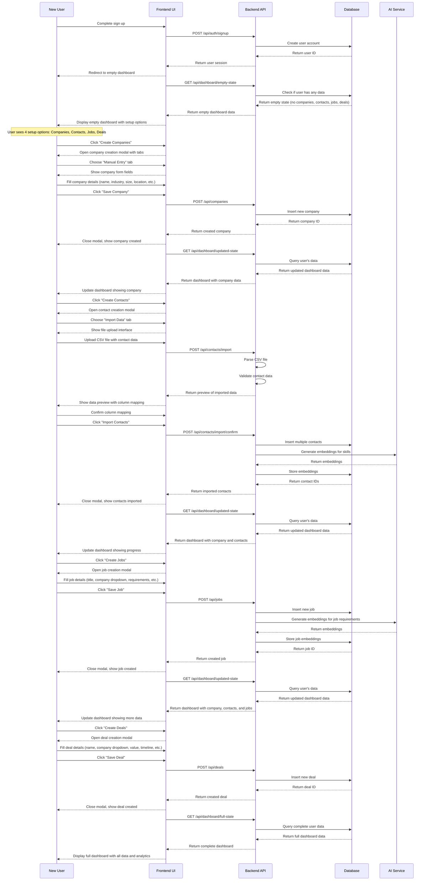
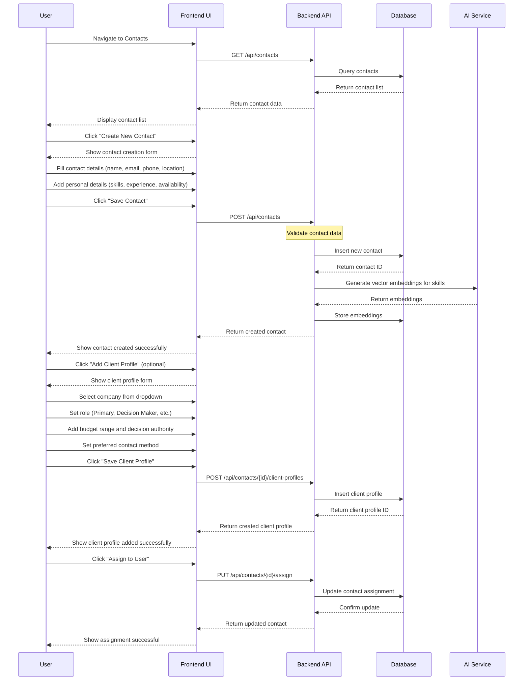
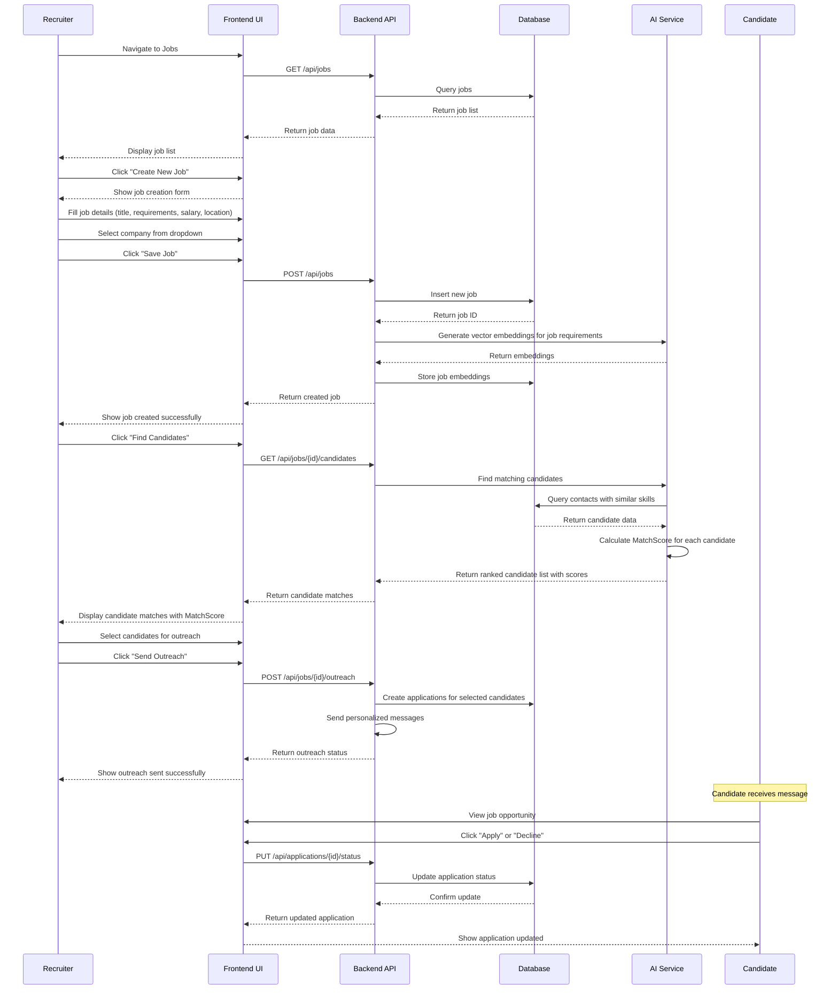
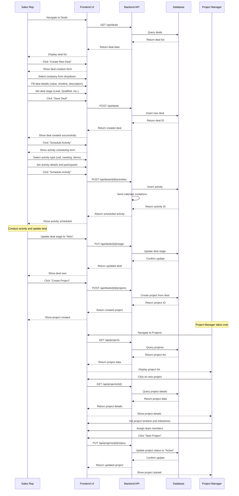
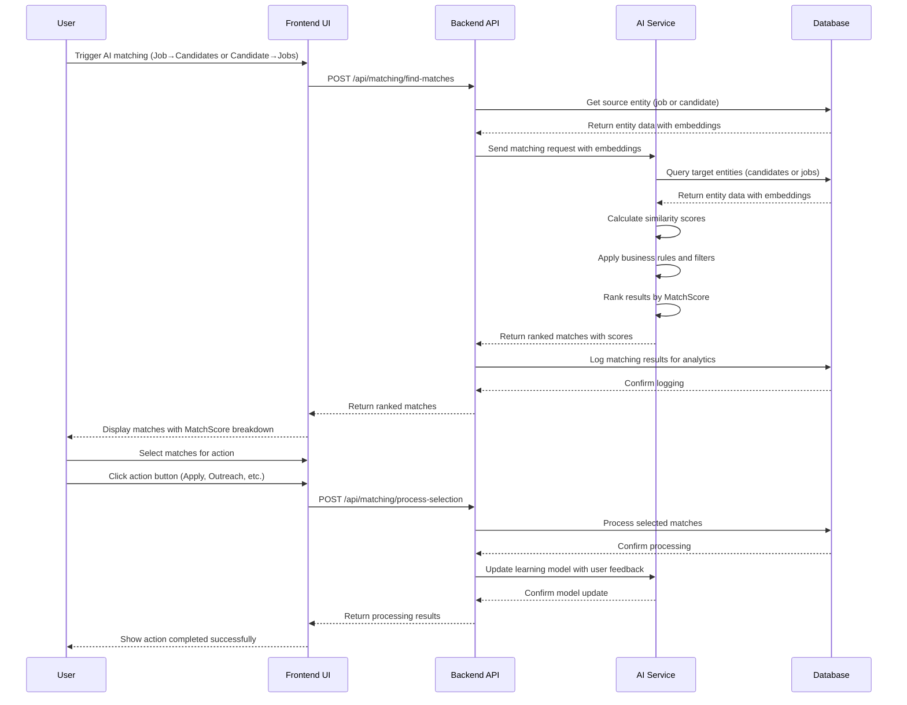

# Sequence Diagrams

## 0. New User Onboarding & Empty Dashboard

## 1. Contact Creation & Client Profile Setup

## 2. Job Posting & Candidate Matching

## 3. Deal Creation & Project Generation

## 4. AI Matching Process

